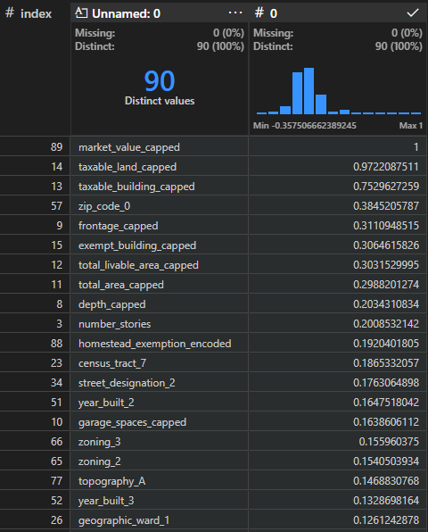
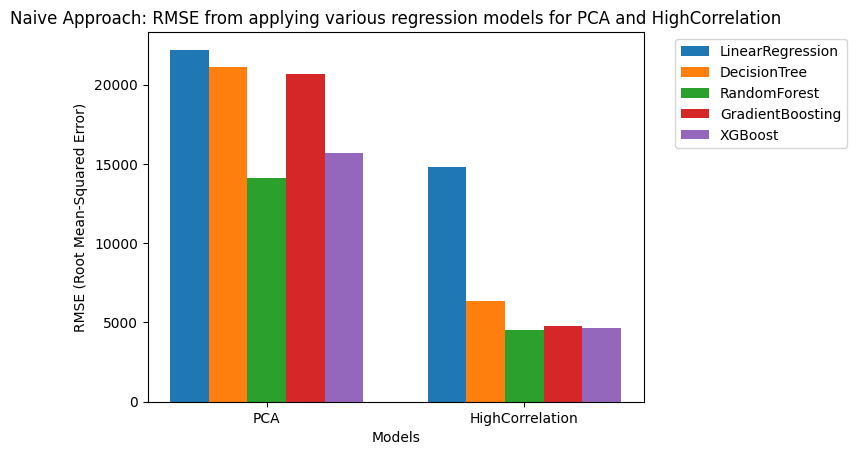

# About

This project is utilizing the [City of Philadelphia Property Assessments Database](https://phila.gov/property/data) in order to predict the market_value of houses by building a machine learning model. The goal of this project is to be able to reliably predict the market_value of the common home in Philadelphia.

# Data Collection

I collected the data from the public database provided by the City of Philadelphia's Office of Property Assessments, by going to their website and downloading the csv. For all intents and purposes of reproducability, my original dataset downloaded from the public database is committed into the repository in the folder `data_collection`. 

# Data Preprocessing

In order to preprocess and clean the data for analysis, I had used an extension in VSCode called Data Wrangler in order to visualize the summary statistics regarding all of the columns.


### Drop columns with overly missing data
My first cleaning attempt was to drop all columns within the dataset with more than 25% missing values as imputing these values would end up skewing my model. 
As such these were the columns removed:
```
cross_reference
date_exterior_condition
fuel
garage_type
house_extension
mailing_address_1
mailing_address_2
mailing_care_of
market_value_date
number_of_rooms
other_building
separate_utilities
sewer
site_type
suffix
unfinished
unit
utility
```

### Drop columns with high cardinality
There were many columns that were simply identifiers for each entry within the database, and we want our model to find patterns within the data, so as such columns with high cardinality (many distinct values) were identified and removed. At this point of data-cleaning, there were about 500k records. As such, I set a threshold that identifies columns with high cardinality or in other words if a column had 20% unique values (116k), then I would simply drop it.

**NOTE:** I had dropped lat and lng because they were too precise of a measurement and wanted to rely on zip code instead as it represents a localized region within philadelphia quite well.

These were the columns that were removed from this operation:
```
the_geom
the_geom_webmercator
beginning_point
book_and_page
location
mailing_street
owner_1
owner_2
parcel_number
registry_number
pin
objectid
```

### Filter Properties to Single Family Homes
Since we are building a model to predict the market_value of homes, I decided to remove any properties that are not homes, such as offices and parks, and public property by filtering on the column `category_code_description` for the following values: `SINGLE FAMILY`. This filters the dataset to simply single-family homes, which is what we are trying to predict for.

This reduced the total number of records to 503k which all represent homes in the Philadelphia region.

### Dropping Specific Columns
- `assessment_date` - I do not want to have the model evaluate the market_value based on the assessment date in order to avoid recency bias, where if a house was evaluated more recently, then it could give a slightly higher / lower market value.
- `category_code` - At this point, there is only one category_code, and as such there is no value to having this column.
- `category_code_description` - There remains only single family home(s), so there is no value to having this column, as it only contains 1 value repeated throughout the dataset.
- `year_built_estimate` - This column is a boolean value indicating if the year built was estimated, but I believe that there is more valuable information that can be used towards a valuation such as the actual year that the house was built (`year_built`), and as such, I decided to remove this column.
- `mailing_city_state` & `mailing_zip` - The mailing address of a property doesn't really tell us much about the value of a property, more about whether if it's different than the property adddress, that the owner could potentially be affluent as it could be their secondary property.
- `building_code` - Using the [metadata website](https://metadata.phila.gov/#home/datasetdetails/5543865f20583086178c4ee5/representationdetails/55d624fdad35c7e854cb21a4/?view_287_page=1&view_287_search=basements) from the Office of Philadelphia Property Assessments (OPA), and other external resources, I was still unable to find a clear definition of what all of the codes used within here had meant. There was no updated manual or guide regarding these codes, so I had to drop this column due to ambiguity.
- `street_code` - This is a five-digit number issued by the Water Department, which appears to primarily be used for identification reasons, and as such provides no value towards the valuation of a property's market value.
- `street_direction` - Had too many missing values and unknowns to impute (63%). Also, this is not an ordinal value, it is simply nominal and provides very few value and I do not want these values causing correlation with the market value as there are many other factors that should come above first such as zipcode or lat/lng (indiciating area based correlation to target variable: `market_value`).
- `building_code_description_new` - Nominal attribute that doesn't appear to have much clarification in the OPA's metadata.
- `building_code_new` - Column of two-digit numbers with no representation to what they mean. Even the OPA's metadata didn't have this property listed, so there was no description.
- `building_code_description` - Removed after filtering for misfiled vacant land properties, at this point we have reliably captured most of the single-family homes within the dataset.
- `central_air` - Had 38% missing values and became impossible to impute as it is a binary column that couldn't rely on any other attributes in order to infer.
- `off_street_open` - Metadata did not provide a clear definition regarding this attribute so I found it hard to use as a feature in relation to the target variable.
- `state_code` - It was a redundant datafiled that had 100% PA values at this point of the cleanup, and we only had houses within the philadelphia region
- `house_number` - This number has no meaningful correlation to market_value and is generated at random within the local neighborhood of each property and each street that the property itself is located at.
- `general_construction` - Too many missing values and unclear definitions for what each unique value in this feature represents. Hard to determine an average in order to impute, so I dropped it.
- `quality_grade` - This is also a feature with unclear definitions that has both letters and numerical representation that was not clarified in the metadata. The data is too messy in order to determine any valuable correlations to the target variable.
- `exempt_land` - The correlation coefficient between market_value and exempt land was 0.06 representing a weak correlation and so this column got removed in the idea of dimensionality reduction.
- `sale_price` - After manually, analyzing the first quartile and the outliers of this data manually, I realized that there are too many values here with crazy extremes, and that this column would have to be dropped.
- `sale_date` - After removing sales after the end of 2023, I decided to drop this column in order to avoid recency bias within the model.

### Imputations
- `type_heater` - Imputed the Missing Values to H, as this letter represents Undetermined for the type of heating system a property has.
- `basements` - Imputed the Missing Values to K, which is a new definition I created for Unknown, as this metric is an ordinal scales that goes like this:
	```
    0. None – Indicates no basement.
    A. Full Finished – Occupies the entire area under the first floor.
    B. Full Semi-Finished – Could have some finish to include a floor covering,
    and ceiling. It looks more like a living area rather than a basement.
    C. Full Unfinished – Is a typical basement with unfinished concrete floor,
    either rubble stone or cement over stone or concrete walls and would have
    exposed wood joist ceilings.
    D. Full – Unknown Finish
    E. Partial Finished – Occupies a portion under the first floor. Be careful of
    areas under sheds and porches. If there is a garage at basement level then it is a
    partial basement.
    F. Partial Semi-Finished – One or more finished areas.
    G. Partial Unfinished
    H. Partial - Unknown Finish
    I. Unknown Size - Finished
    J. Unknown Size - Unfinished
    K. Unknown - Unknown (NEW DEFINITION CREATED)
    ```
- `topography` - Based on the metadata provided from OPA, in philadelphia, most lots are on the street level by average, and so I'm imputing it with F.
    ```
    Most lots in the City are at street level. This is a site that would be at street or sidewalk
    grade or level with a slight contour to permit drainage away from the property. This is
    typical and should be indicated as „F‟ or level. Use one of the following that is most
    appropriate.
    a. Above Street Level - This would be topography where you would have to walk up over
    two (2) flights of steps from the front and rear or is hilly or slopes upward sharply.
    This could pose a problem for development.
    b. Below Street Level - This relates to topography that is below the level of the sidewalk
    and street. You have to go down steps or an embankment. This could pose a problem
    for drainage and development.
    c. Flood Plain - This is a site that falls within an identified Zone A flood hazard zone. This
    is normally found in close proximity to flowing water or a high water table. Typically it
    can be found in South and S.W. Phila., and along the rivers, streams, creeks, etc. It
    could include wetlands or land under water.
    d. Rocky - This relates to areas of the City that have very rocky soil or sub-soil conditions that could have an adverse effect on site grading, construction or installation of sewers
    and water mains. This is normally found in Philly areas, such as N.W. Philadelphia.
    e. Relates to anything not identified here that may be observed that may have some effect
    on value. Indicate what it is in the comments section of this form.
    f. Level.
    ```
- `parcel_shape` - Based on the metadata provided from the OPA, there doesn't seem to be any sort of preference for the shape of the property, and as such I do not want to influence the transformation by assigning it numerical values as that gives implicit priority. As such, I had one hot encoded this column sparsely.
    ```
	Regular-rectangular is typical. Most properties in the City of Philadelphia are laid out on
    streets in a grid pattern and the lots are rectangular in shape. A square lot would also be
    regular. In most cases it will be typical and coded “E”.
    a. Irregular - This would be a lot other than a square, rectangular or a triangle. It is not a
    grossly irregular shape.
    b. Grossly Irregular - This relates to a shape that may include curves, narrow portions, long
    access driveways or shapes where there are possibly portions of the site that cannot be
    utilized because of the physical shape.
    c. Triangular - This is a parcel of land that is triangular in shape.
    d. Right of way - A long narrow parcel of land.
    e. Rectangular
    ```

### Filter Rows based on specific column values
- `building_code_description` - Removed records that were vacant land properties misfiled under single family homes by filtering and dropping the columns
- `sale_price` - Filter records that sold for a price above $1 as these were entered as placeholder values
- `sale_date` - I decided to make the cut-off upto the end of December 2023, as some of these properties listed within the dataset haven't even been fully constructed and so its' market value also tends to have many placeholders.
- `basements` - I removed all values that were not part of the metadata's basement indexing. There were some extraneous values such as 1,2,3,4 that did not have a description.
- `interior_condition` - Removed all values that were not part of the metadata for interior condition, such as 8. I had also dropped 0 from the valid definition criteria as I did not want to include not applicable. As this the definition for interior condition:
    ```
    This could indicate the overall condition of the interior.
    0. Not Applicable.
    2. New / Rehabbed – Noticeably new construction then surrounding properties
    in the GMA. Property is superior to most other properties on the block. Usually
    the following exterior improvements can be observed.

    3. Above Average - would indicate that some work had been done or the level of
    maintenance has been beyond what is typical for the area. The interior would show
    very well and be in move in condition.
    4. Average – would be typical.
    5. Below Average – would be the opposite. It could appear that maintenance has
    been let go and things normally were not repaired or replace on a regular basis.

    6. Vacant – No occupancy. FHA, VA, FNMA signs may be on the property.
    Property has been secured with fresh plywood over doors and windows.
    7. Sealed / Structurally Compromised, Open to the Weather –
    Doors and windows have been covered over by plywood, tin, concrete block or
    stucco. No interior access. Some or no windows, no door or door open, evidence
    of past abuse by vandals such as graffiti, missing railings, deteriorated wood and
    metal, etc. Scorch marks and/or fire and water damage to exterior brick, siding,
    bays, etc. Broken windows with blackened and charred interior.
    ```

### Filter Rows due to missing values
The following rows at this point of data preprocessing have missing values across these features.


For all of these missing values by column, I've decided to drop them instead of going for an imputation as they highly depend on the geographical region, and also rely on the market_value in order to inference properly, but since we are trying to infer market_value, I did not want to influence the dataset creating an influenced dataset.

Moreover, we have 300k records at this point in time, and so I beleive in order to retain the purity of the dataset, it is best if we drop the 13k rows of missing values all together instead of influencing the training data inapproriately.

### Feature Transformations (Categorical / Nominal)

- `basements`: Using the Ordinal Encoder, I transformed the ordinal values: `['0', 'A', 'B', 'C', 'D', 'E', 'F', 'G', 'H', 'I', 'J', 'K']`
- `exterior_conditions`: Similar to basements, except these labels are numerical, however they each represent order as the higher the number is, than the better the condition. `[7, 6, 5, 4, 3, 2, 1, 0]`. At this point, after filtering, I did not have any values beyond 7.
    ```
    Relates to how the exterior appears based on observation.
    0. Not Applicable
    1. NEWER CONSTRUCTION – Noticeably newer construction then surrounding properties in the GMA.
    2. REHABILITATED – Property is superior to most other properties on the block.
    Usually the following exterior improvements can be observed:
    New full or partial brick or other material front
    New windows, doors
    New concrete sidewalks, steps, porch, patio or decks
    If you are not certain, use ABOVE AVERAGE.
    3. ABOVE AVERAGE – A well-maintained property where the owner does preventive
    maintenance on an on going basis and reacts to any deferred maintenance as it starts
    to occur. Exterior physical condition is better than average and less than
    4. REHABILITATED.
    5. AVERAGE – This is the typical and most common physical condition observed at the exterior of most properties on the subject block. No significant concrete work, pointing, painting, carpentry or work to trim exterior walls, doors, windows or bay is required. No obvious defects. Majority of properties in the block or GMA are in this condition.
    6. BELOW AVERAGE – Excessive deferred maintenance, wear and tear, abuse, and/or minor vandalism, or unrepaired minor fire damage. These items are starting to add up and take their toll.
    7. VACANT – No occupancy. FHA, VA, FNMA signs may be on the property. Property has been secured with fresh plywood over doors and windows.
    8. SEALED – Doors and windows have been covered over by plywood, tin, concrete block or stucco. No interior access.
    9. STRUCTURALLY COMPROMISED, OPEN TO THE WEATHER - Some or no windows, no door or door open, evidence of past abuse by vandals such as graffiti, missing railings, deteriorated wood and metal, etc. Scorch marks and/or fire and water damage to exterior brick, siding, bays, etc. Broken windows with blackened and charred interior.
    ```
- `type_heater`: Similar to the rest, ordinally encoded based on the following order as described by the OPA:
    ```
    Type of heater or heating system.
    A. Hot air (ducts)
    B. Hot water (radiators or baseboards)
    C. Electric baseboard
    D. Heat pump (outside unit).
    E. Other
    G. Radiant
    H. Undetermined / None
    ```
- `interior_condition`: Similar to rest, Ordinal Encoding after removing values without any clear definitions from the OPA's metadata, encoded in the order as seen below but 0's and 1's and 8's were removed as they either don't have a clear definition or are non-applicable.
    ```
    This could indicate the overall condition of the interior.
    0. Not Applicable.
    2. New / Rehabbed – Noticeably new construction then surrounding properties
    in the GMA. Property is superior to most other properties on the block. Usually
    the following exterior improvements can be observed.

    3. Above Average - would indicate that some work had been done or the level of
    maintenance has been beyond what is typical for the area. The interior would show
    very well and be in move in condition.
    4. Average – would be typical.
    5. Below Average – would be the opposite. It could appear that maintenance has
    been let go and things normally were not repaired or replace on a regular basis.

    6. Vacant – No occupancy. FHA, VA, FNMA signs may be on the property.
    Property has been secured with fresh plywood over doors and windows.
    7. Sealed / Structurally Compromised, Open to the Weather –
    Doors and windows have been covered over by plywood, tin, concrete block or
    stucco. No interior access. Some or no windows, no door or door open, evidence
    of past abuse by vandals such as graffiti, missing railings, deteriorated wood and
    metal, etc. Scorch marks and/or fire and water damage to exterior brick, siding,
    bays, etc. Broken windows with blackened and charred interior.
    ```
- `view_type`: This was Sparsely One Hot Encoded as I did not want to influence the value of a property by implicitly giving it a value based on its category, as it appears this value is supposed to be understood as a nominal value.
    ```
    View relates to the view from the subject property windows, deck, porch or balcony. In
    most cases it will be typical, and coded “I”.
    I. Typical / Other.
    0. Not Applicable.
    a. Cityscape / Skyline - relates more to a view from mid to high-rise condominium
    units. It would be a view that may be aesthetically pleasing to the eye by observing
    various height buildings, rooftops and other manmade improvements against the
    blue sky and sun.

    b. Flowing Water - relates to a view of either the Delaware River or Schuylkill
    River. It could also include a view of Wissahickon Creek, Pennypack Creek, and
    possibly Frankford Creek, etc.

    c. Park/Green Area relates to a property located directly across from a park or green area.
    In the case of a dwelling, this would be directly across the street. In the case of
    residential condominium units, these would be units that because of their location in the
    building have a view of a park. This could include Rittenhouse Square, Logan Circle,
    Franklin Square, or Washington Square etc. It could include Tinicum Wild Life Pre-
    serve, Schuylkill Valley Nature Center. Fitler Square, or any local park or green area.
    d. Commercial
    e. Industrial
    h. Edifice / Landmark
    ```
- `topography` - This was one-hot encoded as I did not want to categorize this with a numerical value in order to avoid implicit priority, and these values were written in the metadata as a nominal attribute / description. There was no weight really associated with the topography classification from OPA, as shown below.
    ```
    Most lots in the City are at street level. This is a site that would be at street or sidewalk
    grade or level with a slight contour to permit drainage away from the property. This is
    typical and should be indicated as „F‟ or level. Use one of the following that is most
    appropriate.
    a. Above Street Level - This would be topography where you would have to walk up over
    two (2) flights of steps from the front and rear or is hilly or slopes upward sharply.
    This could pose a problem for development.
    b. Below Street Level - This relates to topography that is below the level of the sidewalk
    and street. You have to go down steps or an embankment. This could pose a problem
    for drainage and development.
    c. Flood Plain - This is a site that falls within an identified Zone A flood hazard zone. This
    is normally found in close proximity to flowing water or a high water table. Typically it
    can be found in South and S.W. Phila., and along the rivers, streams, creeks, etc. It
    could include wetlands or land under water.
    d. Rocky - This relates to areas of the City that have very rocky soil or sub-soil conditions that could have an adverse effect on site grading, construction or installation of sewers
    and water mains. This is normally found in Philly areas, such as N.W. Philadelphia.
    e. Relates to anything not identified here that may be observed that may have some effect
    on value. Indicate what it is in the comments section of this form.
    f. Level.
    ```
- `homestead_exemption` - This was a numerical column that simply represented the taxable portion of a property's assessed that I converted into binary representation (where it represents a property's taxable portion has been reduced or not). I had done this because I found that the correlation of this number was 0.13 and reducing the numerical representation to a simple binary had made more sense as it was an application process where a property owner would either be able to reduce or not reduce their property's taxable valuation. Most of the values were either 0 or 80,000, so I felt it was appropriate to conform. The correlation did drop but it was neglible drop of about -0.01.
- `zoning` - This was a categorical column with many nominal features that represents what types of buildings can exist within a certain region within Philadelphia. There were 35 different zoning categories, and as such I had decided to binary encode this column in order to retain the information as sparsely as possible. (Created 6 columns, instead of 35). This allows me to not show priority to any specific zoning category, while retaining the data. The Binary Encoding representation is in the following order (for each element in the index, it corresponds from 1-36 in binary bits creating 6 columns):
    ```
    ['RSA5' 'RSA3' 'RM1' 'RMX2' 'RSD3' 'RM4' 'CA1' 'RSA2' 'RSD1' 'CMX4' 'CMX5'
    'CMX2' 'RM2' 'RSA4' 'RSA1' 'ICMX' 'RM3' 'RMX3' 'RTA1' 'RMX1' 'I3' 'IRMX'
    'CMX1' 'CMX3' 'RSD2' 'I2' 'RSA6' 'I1' 'CMX2.5' 'SPINS' 'SPPOA'
    'RSD1|RSD3' 'ICMX|SPPOA' 'CA2' 'RSA5|RSA5']
    ```
- `zip_code` - This was a numerical 5-digit column that had a nominal representation as it represented a specific location within Philadelphia. I had tested the correlation prior to scaling and there was a small positive 0.07 correlation, and so I wanted to retain this information, as I know that certain regions within Philadelphia are known to be expensive and I wanted to draw out that relation within my model, so as such, I had binary encoded this feature.
- `geographic_ward` - This is a number that represents certain regions within philadelphia, but in a more precise manner than zipcode, so these are meant to be treated as labels for specific regions. I did not want to keep these values numerically, as higher number could cause a relationship that was not intended as this attribute is meant to be interpreted as purely nominal, as such this column was binary encoded.
- `census_tract` - This is a number that also represents certain regions by population density within philadelphia as seen [here](https://www2.census.gov/geo/maps/DC2020/PL20/st42_pa/censustract_maps/c42101_philadelphia/DC20CT_C42101.pdf). I did not want the numerical representation of this number to create false relationships as just because a number is higher doesn't mean there is more population within that specific tract / region. As such, this column was also binary encoded.
- `street_name` - A nominal attribute, for which I had first converted via the binary encoder this value in order to avoid accidental bias towards a specific street name. There were 2458 values, so OHE would have increased the feature dimensionality by far too much.
- `street_designation` - Another nominal attribute representing the street suffix of where the property was located. I wanted to find out whether there was any correlation between the street_suffix such as avenue and street and lane and drive in tandem to the market value. Since there were 22 unique values, I had binary encoded this column.

### Removing Outliers from the numerical columns
There are many attributes with very large skew, such as the example shown below for the depth column.


There were very few samples causing such massive skews and outliers, but I wanted to still encode the fact that these outliers were still within the dataset.
As such, I had clamped the values where the lower bound was the 5th percentile and the upper bound was the 95th percentile.
Afterwards, I had applied IQR onto the capped version of this column. This technique is called winsorsizing, and I had made a generic function to apply this onto
any columns for which I noticed had high skews.

The effects of this function on the depth function can be seen below. As you can see, the outliers were removed, but were still retained by imputing them to the upperbounded value.


The following list of columns were winsorized:
```
depth
frontage
garage_spaces
total_area
total_livable_area
taxable_building
taxable_land
exempt_building
market_value (Custom Percentile [explained below])
```

Market_Value is our target column, but it has quite a wide spread as shown below, but I wanted to retain as much of this data as possible, but not have the absurd outliers as shown below. As such, I used the same winsorized generic function but targeted a wider percentile: [5, 99]


After applying the winsorsizing function with the larger percentile, you can see the distribution much more cleanly now, and it is much more appropriate to scale.


Overall, at this point the data has been cleaned and there are no more categorical variables or missing values or any absurd outliers that remain in the data. Some features have also been engineered with additional values to provide some context in regard to their missing values, and some features were imputed with their average value for missing features. The specifics were mentioned above. At the end of this step, there are two files that are created: `filtered.csv` and `scaled.csv`. The first file is after we've filtered all of the missing values out and engineered/imputed some values for features, and scaled is after we've scaled select numerical columns.

# Feature Engineering

At this point, our data has been preprocessed and all columns have been converted into numerical columns, but they require scaling in order to ensure no one feature dwarfs its own representation when being built into a machine learning model to predict the market_value.

For columns that were binary or binary encoded or one-hot encoded, I decided not to scale those columns. The columns that have numerical values that are not between 0 and 1, I had applied the standard scaler as the skews have been forced into as close as possible into a normal distribution where the highest skew is 0.5 (absolute), which I believe is low enough to still provide valuable information after scaling without dissoluting the data improperly.

As you have also noticed, some variables were transformed within the last section as well such as homestead_exemption based on its metadata defintion and new variables were introduced in those sections as well (basements). As such, this section primarily involves applying standard scaler. Some missing values were also imputed with their appropriate definition (such as type_heater with H).

### Feature Selection

I computed the correlation with the `market_value_capped` variable in order to deem features with the most correlation, so we could use these features in our models.
All of the correlations between the columns and `market_value_capped` is stored in the file: `all_corrs.csv`.

As you can see here of all the strong positive correlations from select features after data pre-processing.
I will be selecting features with strong than 0.2 positive correlation to use within my models.

This results with these top 10 features that will be used within my models:
```
number_stories               0.200853
depth_capped                 0.203431
exempt_building_encoded      0.239870
total_area_capped            0.298820
total_livable_area_capped    0.303153
exempt_building_capped       0.306462
frontage_capped              0.311095
zip_code_0                   0.384521
taxable_building_capped      0.752963
taxable_land_capped          0.972209
```



The top 10 features shown above are saved to a dataset called: `high_correlations.csv`.

Moreover, I will also apply PCA on the entire scaled dataset up 10 principal components, in order to deem if we can build better models with 10 principal components, which will be saved as `pca_10component.csv`.

When applying PCA, these were the explained variance ratios when applied up to 10 principal components, we were only able to grab 0.59 of the variance across the whole dataset with only 10 principal components.
```
[0.14330905 0.10408661 0.09189723 0.0580442  0.04234404 0.03984931
 0.03544096 0.02981967 0.02824006 0.02141405]

 Sum: 0.5944680612855746
```

# Construction of Test Dataset

I had done the general rule of 80-20 train/test split using the random state of 42, as we have done in class in order to generate the test vs train dataset. Originally, I had thought about stratifying or k-folding, but there are too many individual classes with their own spreads and variances, that it would be best to cover them all through just pure randomization. The dataset was constructed in my `model_development` folder.

# Model Development

First, I had went about it naively and applied all 10 principal components to a model using the aforementioned test_train_split and all of the features of the high correlation model, in order to deem what model performed best.

I tested my naive approach across the following models: LinearRegression, DecisionTreeRegressor, RandomForestRegressor, GradientBoostingRegressor, XGBoostRegressor.
I had used all of the features between the PCA dataset (all principal components) and all features from the high correlation dataset.

For my Naive Approach, you can see the model's performance when using the score function across all the models with the PCA dataset and High Correlation dataset.
The score function was set to output as $R^2$. Higher bars represent better performance when it comes to the model's scores.


Furthermore, I had also evaluated the RMSE across both datasets in order to see which dataset had generally produced more accurate predictions. In this graph, lower bars represent more accurate predictions, as it means there was less error.



Table showcasing RMSE from Naive Approach on various regression models.
